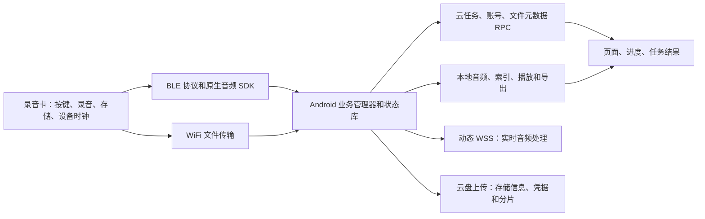

# A1 官方客户端运作与独立替代：集中研究结论

日期：2026-09-25。对象：本地官方 Android 8.5.8.3 APK、配套 libDingerSdk.so、已有 A1 研究记录。目标：独立客户端覆盖录音卡的非固件升级功能。

**范围更正（同日）：转写、翻译、总结、备忘和自定义工作流都属于必须可由自有/本地服务接管的设备配套功能。继续调用官方付费服务不构成完成目标。排除钉钉工作区、团队共享、组织成员、联系人及内部协作；设备通信所必需的首次配对、鉴权和音频解密仍在范围内。** 下文对官方云接口的描述仅用于恢复客户端输入输出和行为，不将该云服务的权限、订阅或账号系统作为目标依赖。

## 1. 结论

本摘要之后补做的逐模块深挖，见 [A1官方客户端逐模块审计](A1_CLIENT_MODULE_AUDIT_2026-09-25.md)。其中新增原生认证/音频加密、缺包阈值、文件操作完成条件和H5转写翻译消费逻辑；更具体的证据边界以该报告为准。

相关模块通过静态分析与已有抓包交叉验证。软件的主要业务骨架已经能贯通解释；本轮进一步补齐云任务接口、字段结构、RPC 编码、实时转写入口和历史文件上传链。

**这足以确定独立客户端的实现路线，但尚不等于已经完成替代。** 剩余重点是可靠拿到完整音频、保存和恢复业务状态、验证本机支持的能力，以及确认首次使用/凭据失效时的依赖。固件内部怎样执行每条命令无需全部还原。

本轮为只读静态研究，没有安装 App、触发录音、改卡设置或发起云写入。设备功能实测仍以已有记录为限。日本版设备的全部参数、权限和能力不能直接用其他地区的客户端分支代替。

## 2. 官方实际分工

按键、定时和云联动跨越几个层次：卡执行录音动作，客户端安排状态和任务，云服务处理转写/纪要/投递。独立客户端可以自己实现后两层，但不能凭软件设置创造卡没有上报的独立按键事件。

## 3. 覆盖矩阵与实际距离

| 领域 | 已恢复的官方机制 | 对独立替代的判断 | 仍需收口 |
| --- | --- | --- | --- |
| 连接、能力和状态 | 连接后鉴权/初始化、能力门、电量/空间/录音状态、云连接占用 | 已有主要调用链 | 首次绑定及凭据过期全流程；日版真实能力；独立新版重连验收 |
| 开始/暂停/恢复/停止 | 0x0100、业务前置条件、设备主动事件、回调和状态传播 | 常用操作可按已知协议实现 | 同步期间操作、迟到应答、重连状态恢复 |
| 右侧语音键 | aikey_option 设备模式与 voice_button_function_mode 云选项分层；先云写后设备写 | 可选择已知模式，收到音频后可自定义处理 | 任意新设备模式没有证据；云与卡不一致时的恢复 |
| 左侧录音键 | 属于设备录音行为，尚未找到独立重映射接口 | 可以处理已上报事件 | 不能宣称左右键的短按/双击/长按都能任意重定义 |
| 实时音频 | 流头、音频包、停止、缺包补传；原生 Ogg 组装；Java 推送与云 WSS 分开 | 已知主路径 | 格式版本组合、乱序/重复/丢包、结束条件及解密完整性 |
| 历史文件 | 列表、BLE 下载、WiFi 快传、转换、索引、取消、超时 | 调用与生命周期可解释 | 大文件、断连续传、取消竞争、完整音频落盘验收 |
| 删除、导出、分组 | 卡删除、本地缓存删除、云回收站/恢复分开；导出和合并独立进度 | 应分别实现 | 所有格式/合并分支未逐一恢复；删除只宜用专用样本验收 |
| 定时 | 云查询→过滤/排序→秒级计划→0x011A 下发；能力门和重试 | 手机端任务编排可以自己写 | 本卡是否支持自主离线执行、容量及断电保持；手机后台限制也需要验证 |
| 转写、翻译、纪要 | 创建任务、动态 WSS、结果模型、异步状态、文件关联 | 可以接自己的 ASR/翻译/LLM | 使用官方云则还需正式会话和权益；自己的服务需定义完成/失败/重试契约 |
| 云文件 | 创建上传任务→云盘存储信息→上传→关联 fileId/spaceId/dentryUuid→状态落库 | 自有存储可以覆盖此用户功能 | 上传成功与元数据成功之间的恢复与去重 |
| 助手/投递/规则 | 相关 IDL 接口和业务路由已定位 | 自有助手可以消费同一音频 | 官方联系人、组织、知识库和权限不能由本地代码替代；每个接口是否被本卡页面使用需进一步核对 |
| 权益/账号管理 | 账号、绑定、设置、部分商业服务模型存在 | 与自主录音/处理可分离 | 全新设备首次启动是否能彻底脱离官方账号尚未证明 |

不要用“已知道命令数量”换算完成百分比。当前距离目标主要在可靠性与验收，也有首次绑定、完整性算法等静态研究缺口；不是只剩把界面包装一下。

## 4. 按键与定时的明确回答

### 按键

- 设备已知 `aikey_option` 为 1000/1001。之前的现场记录支持：1000 有按住送音频/松开停止路径；1001 可持续录音、再次操作停止。不同业务模式、睡眠和同步状态会影响动作，不能把这个结论扩展到所有按法。
- 官方页面的多个选项不对应多个新的设备录音模式。`DingerInterfaceImpl.k2` 的 fallback 控制流将选项 `"2"` 映射为 1001，部分其他选项仍为 1000；`pt8.g3` 再决定备忘/助手/投递的后续处理。
- 音频后续处理可由客户端自行决定。可以送本地模型、自己的 API、保存备忘、触发自定义工作流。
- 尚未找到允许写入任意按键脚本，或分别配置左键全部按法的官方接口；给枚举发送陌生数字不是可靠的自定义方法。

### 定时

`hsp` 获取未完成计划，过滤过期/无效项，将毫秒转为秒并排序，随后通过 `lj2.g0` 发送 `0x011A`：`did/action=set/current/params[{sid,start,end}]`。空列表也会下发，因此不能用空计划当无副作用查询。

官方门槛为 `cap_schedule >= 2`；此前本机记录为 1，两者存在差异，不能保证日版卡支持官方这条离线执行路径。自建手机端定时可以在到时后发开始/停止命令，但依赖手机后台运行和当时连接。卡内定时则需证实设备接受、断连后执行及计划持久性。两种能力应分开验收。

## 5. 云 RPC：已恢复到字段和序列化层

详细方法清单见 [CLOUD_CONTRACT_ROUTES](CLOUD_CONTRACT_ROUTES_8.5.8.3_2026-09-25.md)，结构化字段/类型/FieldId/文件哈希见 [CLOUD_CONTRACT_INDEX](CLOUD_CONTRACT_INDEX_8.5.8.3_2026-09-25.json)。清单按相关接口包收集，**不代表所有接口在 A1 上都有可达入口**。

本次索引包含 **11 个服务接口、90 个非升级方法、185 个递归关联模型**。已核对 196 份服务/模型源文件哈希、90 条路由唯一性及文档链接；17 个无 FieldId 的模型保留为空结构，不虚构字段。多参数方法保留完整参数列表，不能将末尾一个参数误当整个请求。

### 5.1 地址与请求体

`lcq` 创建服务代理，`ydp/zdp` 组装路由，`qcq` 定义 `/r/` 前缀和 `/` 分隔符；有 `@AppName("DD")` 的接口增加 `Adaptor/`，服务名去掉末尾 Service 部分。例如：

- `/r/Adaptor/DeviceTaskI/createTranslateTask`
- `/r/Adaptor/DeviceFileI/createFile`
- `/r/Adaptor/DeviceSettingI/updateDeviceSetting`

这些是 **LWP 逻辑 RPC 路由**，不是已经确认可用 `curl POST https://某域名/...` 调用的 HTTP API。运行时 URL 替换、传输网关和认证过滤器仍可能参与。

`ydp.g` 去掉最后一个回调参数，将业务参数交给 `dt3`：

| dt | 编码 | 已确认细节 |
| --- | --- | --- |
| 默认 p | IDL msgpacklite | `lkl→rti`；Marshal 对象按 FieldId 写 map，省略 null 字段；多个参数可连续序列化 |
| j | UTF-8 JSON | `ivf` 使用 Fastjson；传入的是参数数组，不一定是单个 JSON 对象 |

`cast(args, false)` 的 false 在 p 分支控制顶层数组是否逐参数展开，**不是关闭 gzip 的证据**。整个传输层是否另有压缩不能从这里断定。`stream:new`/`rpc-msg:new` 是分支内已见头字段；实际 Host、会话头和签名没有凭空补成 Bearer 格式。

### 5.2 核心任务请求

`defpackage/ga8.java`：

| 方法 | 官方业务填充的重点字段/意义 |
| --- | --- |
| createRecordTask | accountType/accountId/deviceId/requestId、startTime、state、stateCode=0、attributes、timestamp、fid |
| updateRecordTask | 账号/设备/fid、state/stateCode、updateParams、requestId/timestamp；可带位置 |
| createTranslateTask | 账号/设备/requestId；attributes: Format=opus、SampleRate=16000、SpeakerCount=1、Protocol=5；SourceLanguage/TargetLanguages/LanguageHints，条件性 scene |
| createGenerateMinutesTask | 账号/设备/requestId/fileIds/attributes；返回任务和文件纪要信息 |
| createSyncFileTask | 账号/设备/requestId/fileNames/fileDurations/timestamp |
| createUploadFileTask | 账号/设备/requestId；返回 task 和 spaceId，调用本身不是二进制文件上传 |
| updateDeviceTask | taskId、账号、state/stateCode、requestId/timestamp/updateParams |
| queryOngoingScheduleDeviceTask | 账号/设备/requestId/scheduleTaskType=0 |

模型定义里的字段存在，不代表必填；业务填充、服务校验和返回值还需分别看。`LanguageHints` 的现有 Java 分支是“不存在 languageHints 时用 targetLanguages”，不能擅自改写成通用标准。

### 5.3 实时转写

`ugu.b→ga8.d→CreateTranslateTaskResultModel.translateTask.audioStreamWssUrl→pt8.f0→DingerAudioTools.StartAsr`。WSS 地址由任务响应给出，并有基于参数字符串的缓存；不是 APK 中一个永久固定 URL。

原生库 `OpusAssemble.getOggHeader`（VA 0x3144c4）及 `getOggFrame`（0x315848）明确调用 Opus 头、Ogg packet/page 组装，`writeOggPage`（0x3156f4）组合 page header/body。因此实时音频路径含 Ogg 封装，不能将 BLE 通知原封不动送云端。

`WebSocketPrivate.Send(char*,int)` 后的异步发送路径在 0x29f9e0 设置 opcode 参数为 2；结合发送调用链支持二进制帧路径。尚未逐帧证明头页/音频页的所有发送边界和关闭时序。`parse_json_need_reconn`（0x2961f4）识别 `payload.name == TaskFailed` 并参与重连判断；这不构成完整转写文本响应 schema。

该调用的 0x1ba440 PLT 项已用 ELF `.rela.plt` 核对为 `WebSocketPrivate::SendImpl(string const&, websocketpp::frame::opcode::value)`，避免只凭寄存器常量猜测发送类型。

`DingerImplAsr.OnStreamDataCallback` 给 Java 的 `body:{len,volume,data,source:device_chat}` 是本地 SDK 回调格式，不能当作云端返回 JSON。不能直接套其他阿里语音产品的 StartTranscription/StopTranscription 协议。

### 5.4 历史文件上传

实际链：`ecv UploadFileTask→ga8.f→zz4 CloudFileOperate→SpaceInterface.t3→SpaceInterfaceImpl→g5s→UploadProxy→g8t→m6s→h73→p73`。

1. 创建上传任务，获得 cloud taskId 和 spaceId。
2. 使用本地文件路径创建云盘上传任务；`m6s` 的内部/外部上传控制器各设并发数 1。
3. `p73.f0→r5s.d0→CSpaceService.uploadInfoV2` 请求存储配置。请求含 spaceId、path、name、fileSize、冲突策略、来源；提出 `partSizeOfClient=262144`（256 KiB）。
4. 若服务选择 `HttpToOssWithAk` 且有 ossInfo，客户端读取 bucket/endPoint 和临时凭据，protocolType=2；服务器还可返回 partSizeOfServer。**256 KiB 是客户端请求值，不证明所有实际分片都固定此大小。** 另有次选协议和凭据刷新逻辑。
5. 二进制上传交给通用 FileService；成功回调若 mediaID 为空，仍判失败。
6. 返回 SpaceDo 后，再经 `r78.b` 关联 fileId、spaceId、dentryUuid；更新本地记录及任务状态。可选 DOA 附件失败存在继续主音频流程的分支。

由此可知，上传字节完成、文件元数据关联完成、纪要完成是三个不同阶段。自有服务应保留这些阶段和恢复能力，不需要复刻整个钉盘实现。

### 5.5 文件、助手与设置

`r78.createFile` 发送 fileName/deviceId/account/md5/source/groupId 和 attributes（fid、加密/合并/裁剪/隐身标志、sid 等），本地 createTime/duration 的秒值在这里乘 1000。`listNews` 使用 syncFileVersion/pageSize，`loadHistory` 使用 cursor 等字段；两者在接口中确实存在，不能只用 void 方法筛选而漏掉它们。

相关 IDL 包还提供：文件分组与恢复、连接请求/占用、设备设置、AI scene/rule/summary/function-call、A1 助手 createAudioMemo/mission 查询与执行、笔记及商业服务。字段清单已和主任务放在同一索引；接口存在本身不证明日版账号开放，也不证明已经恢复这些服务的全部业务含义。

## 6. 必须由自有/本地服务接管的范围

| 能力 | 目标实现 | 边界 |
| --- | --- | --- |
| 录音/下载/本地播放 | 本地协议、音频转换、数据库 | 查明必需的设备凭据；不复刻钉钉账号体系 |
| 转写/翻译/总结 | 本地模型或用户自己的服务适配器 | 官方付费 WSS、任务接口和权益不是完成前提 |
| 存储/文件分组/备忘 | 自有文件库与元数据 API | 不需要官方 spaceId/dentryUuid 和钉盘权限 |
| 助手与后续动作 | 自定义路由和工作流 | 排除官方组织、联系人和内部协作；保留通用自定义动作 |
| 定时编排 | 自有任务库和手机后台调度 | 卡内离线计划必须满足设备能力，不由云替换自动获得 |

建议独立客户端内部以 `(deviceId,fid,录音来源)` 标识设备记录，另存自有 recordingId；分离设备录音状态、传输状态、云处理状态。记录完整性失败应保留 incomplete 状态，不得显示“完成”。请求使用自有幂等键；断线上传续传、校验、云作业回查、明确结束/错误语义应作为替代契约。以上是实现建议，不是宣称官方服务器具有同样的接口。

## 7. 剩余研究与验收，集中收口

### 静态仍需深入的点

| 原剩余项 | 取舍与优先级 | 完成证据 |
| --- | --- | --- |
| 首次绑定/鉴权/密钥 | P0，保留设备必要部分；剔除组织管理员审批等生态流程。确认设备鉴权和文件解密是否使用同源密钥、缓存和更新条件 | 首次使用、已有绑定离线重连、凭据缺失/失效分别有明确结果；不能把永久脱离官方初始化当已证事实 |
| Fsync/V2 音频完整性 | P0，全部保留。这是自有 ASR、播放、导出共同的输入基础 | 同一测试音频的完整性、格式、时长和可解码性；掉线/补传后无静默损坏 |
| 实时云会话 | P1，改为恢复客户端输入输出和生命周期：音频、临时/最终文本、翻译、失败、停止。剔除官方付费鉴权、网关复制及服务器内部实现 | 自有/本地服务能消费音频，向独立客户端返回可展示/保存/关联的结果；无需复用官方字节协议 |
| 导出/合并/助手投递 | P1，保留格式转换、裁剪/合并、备忘、自定义后续动作；剔除钉钉联系人、组织投递和内部协作 | 本地生成可播放/可导出的成果；自定义动作可替换，失败可恢复 |

按键、设置持久性、卡内定时和日本版能力继续属于设备验收主线，不因上述范围收紧而删除。已有 90 方法索引是证据目录，不能把其中所有通用钉钉接口都列成实现任务。

### 范围更正后的新增静态发现

- **设备鉴权依赖链**：`x78.p:313` 取 `DeviceModel.deviceSecret`；`lj2.s:2565` 密钥为空立即失败；随后 `lj2.E:1524` 用 `0x0008` 和 `corp_id` 请求随机值；`lj2.r.onSuccess:1189` 调用 `AESEncrypt(deviceSecret, returnedValue)`，将返回 token 连同 corp_id/model/timestamp/sdk_ver 发往 `0x0133`。这里只确定参数流，AES 模式、编码和两个入参的原生语义仍需继续核对。标识名为 corp_id 不表示必须实现组织产品。
- **加密音频导出有另一条取值路径**：`pt8.O1:3437` 优先 `x78.p`，条件成立且为空时使用 `x78.w` 缓存，再调用 `s98.a:152` 查询 `file_encrypt_secret`。这是设备音频能否离线读取的直接依赖，不能因请求来自云端就删去；是否本机走该条件分支还未实测。
- **转写消费格式已经进一步恢复**：`pt8.m.EventCallback:1427` 将 event=0 交给 H5 的 `asr_result` 或 `xgw.m`；`xgw.e:108` 要求外层存在 type/payload，并按 `payload.name` 处理 SentenceBegin、TranscriptionResultChanged、SentenceEnd，文字取 `payload.sentence.text`。当前实现的 SentenceEnd 把缓存中的临时文字入列表，而不是直接使用该结束包的 text。这说明适配器应明确临时文字和最终文字语义，不能只显示所有文本包。
- `VoiceMsgPopDialogV2` 还识别 `ResultTranslated` 名称，但所读分支没有实际渲染处理；不能仅凭字符串认定翻译适配已完整恢复。H5/其他消费端仍需追踪。
- **导出早期成功不是完成**：`gs8.d:170` 先 `callback.onSuccess(null)`，再调用 `ExportAudioWithProgress`，随后才根据返回码和输出路径成功/失败。独立实现应区分任务受理与文件生成完成，避免照抄“成功回调即结束”的假设。

下一步按依赖顺序集中做三包研究：①设备凭据与完整音频；②转写/翻译/总结的可替代输入输出；③按键动作路由、定时、文件操作与恢复。每包形成可实现的状态/字段清单后统一验收，不以继续接通官方付费接口作为进度。

### 可以合并进行的实机验收

准备一个无隐私的短音频及专用测试文件，然后一次测试会话验证：连接/能力读回→已知按键两模式→实时录音与本地播放→同一文件 BLE/WiFi 完整性→断连恢复/取消→设置重连保持。卡内定时只有确认能力后另加短计划；删除仅针对测试文件。并行采集本地状态、消息类型/序号/长度、文件校验和；不输出账号令牌或录音内容。

为确认替代输入输出，可观察官方客户端已经可用的处理过程，仅采集脱敏字段结构、状态、载荷长度/格式和请求关联信息；不以购买权益或接通官方付费服务为前提。静态消费端能解决的契约优先静态恢复。仅 HCI 日志无法恢复手机到服务器的 TLS 明文；无需取得阿里服务器内部实现。

这组验收不需要不断零散询问用户；需要用户操作的按键可提前排成一张顺序表。未获当前授权时不执行设备写入或录音。本报告也不把历史抓包、静态源码、测试通过当作新版本实机成功。

## 8. 证据位置与局限

- 设备端 28 项调用链、补传/超时公式、哈希：[CLIENT_CALLCHAIN_MATRIX](CLIENT_CALLCHAIN_MATRIX_8.5.8.3_2026-09-25.md)。本报告补充其云端部分，不删除原有未验证项。
- 业务 Java：`apks/8.5.8.3/work/src/sources/defpackage/{ga8,r78,ecv,zz4,ugu,pt8,p73,r5s,m6s,h73}.java`。
- 服务/模型：`apks/8.5.8.3/work/cloud28/sources/com/dingtalk/`。
- RPC：`work/cloud_transport/{lcq,ydp,zdp}.java`；`work/cloud29/sources/defpackage/{qcq,dt3,ivf,lkl,rti,g2i}.java`。
- 原生：`work/libDingerSdk.so`；`work/cloud_native_disassembly.txt`。自动反汇编字符串注释可能含寄存器跟踪误注，结论优先采用真实符号/调用/指令。
- classes28 全量反编译有 1 个错误，classes29 有 36 个错误，不能称为完整无损源码。被引用相关方法逐项阅读；未成功恢复的控制流不当作已知。
- 原包、反编译和抓包位于忽略目录，研究文档仅描述字段及机制，不含实际密钥、会话 URL 或私人音频。

研究文档描述的是该 APK/库样本，服务端灰度、账号权益、机型及地区差异仍需现场证据。下一阶段判断标准是：独立客户端在目标日版设备上完成用户流程，并能正确处理失败。
