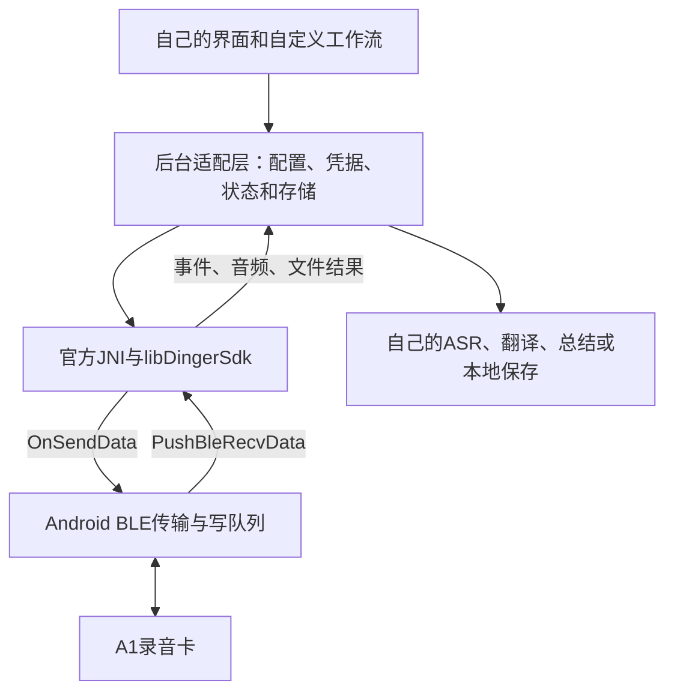

# 使用官方后台开发自己的客户端

目标：自己的UI、设备管理和自定义动作，复用官方原生协议/音频实现。无需先重写所有内部算法。

## 发布包位置

[`vendor/dinger-sdk/8.5.8.3/`](../vendor/dinger-sdk/8.5.8.3/)包含整理出的本地官方APK后台提取件。具体来源、哈希和第三方权利说明见该目录README与NOTICE。没有官方前端、整个APK、账号会话或设备密钥。

| 路径 | 含义 |
| --- | --- |
| jniLibs/arm64-v8a/libDingerSdk.so | 协议、音频、文件处理核心 |
| jniLibs/arm64-v8a/libc++_shared.so | C++运行库依赖 |
| java/com/android/dingersdk/nativeInterface/ | 15个顶层Java文件；其内部还包含嵌套回调类型 |
| dinger-jni-core.jar | 9个核心Java文件编译生成的Java8接口JAR |
| manifest.json | 17文件发布哈希/大小；Java另记注释脱敏前哈希 |
| package-manifest.json | 本发布包全部其他文件的SHA-256和大小 |
| interface-inventory.json | 42个native方法声明以及相较旧版的差异 |

## 1. Android接入准备

目前提取件只有ARM64 ABI。在自己的Android工程中，复制两份.so到`app/src/main/jniLibs/arm64-v8a/`。使用核心JAR或对应9个Java源二选一，避免重复类；其余6个辅助源按需加入，注意Android Log/JSON和AndroidX NonNull依赖。

不能改`com.android.dingersdk.nativeInterface`包名或JNI依赖的类/方法/字段。混淆规则：

```proguard
-keep class com.android.dingersdk.nativeInterface.** { *; }
```

SDK与JNI声明保持同版，宿主已有libc++_shared.so时核对版本兼容，不以随意pickFirst掩盖冲突。DT_NEEDED仅列出C++与Android系统库，不等于所有可选模型和运行时资源已齐全。

## 2. 只实现宿主必须提供的部分



主要宿主职责：蓝牙权限/发现/订阅通知、写队列和MTU适配、生命周期和回调线程、准备目录与配置、提供凭据、保存业务状态。不要直接复制依赖官方账号/UI的大型业务类并期待它独立启动。

初始化和调用的**概念顺序**如下，不是可直接编译的示例（具体签名以包内Java声明为准）：

1. 装载DingerAudioTools，确认GetSdkVer能返回；按官方InitConfig契约准备目录和配置。
2. 注册RecvMsgCallback；将OnSendData排入BLE写队列，收到通知后调用PushBleRecvData。
3. 用已取得的凭据完成0x0008/0x0133鉴权；对真实应答判断成功。
4. 根据目标功能发命令或调用专用接口，如文件同步调用SendFileSyncCmd建立SDK内部状态。
5. 按回调类型处理结果，完成后解除回调和释放相关文件/流资源。

初始化细节和官方上层调用锚点见[原生客户端流程](../NATIVE_CLIENT_FLOW_2026-09-24.md)及[调用链矩阵](../CLIENT_CALLCHAIN_MATRIX_8.5.8.3_2026-09-25.md)。不要根据这个概念顺序臆造InitConfig参数。

## 3. 输出如何消费

| 输出/入口 | 用法 |
| --- | --- |
| MsgCallback | 命令应答；关联请求、错误与超时 |
| EventCallback | 设备状态和录音相关事件；不要只监听自己点击按钮后的返回 |
| StreamDataCallback | 按tag/模式解释字节，不一律当PCM；未知tag保留诊断而非假报成功 |
| openAudioFile/readAudioFrames | 通过AudioFileParam、AudioFileAttr、AudioFrameBuffer读取音频属性和解码数据 |
| OpusConvertToOgg | 容器转换不等于所有加密文件均被解密 |
| Export/Merge/Clip | SDK内部处理，宿主提供参数、取消和结果保存；进度100%不能替代产物检查 |

同一下载只能有一个重组/ACK/落盘负责者。选择SDK托管后，不让自写协议层重复ACK或截走补包。完整性应核对文件列表声明大小、实际接收、缺包状态和解码结果；不能仅因收到停止事件就宣布下载完成。

## 4. 自定义范围

- 右键已知模式1000/1001；音频输出可接自己的备忘、语音助手、翻译和自动动作。不宣称支持任意固件按键脚本。
- 手机端定时可在到点时发控制命令，依赖手机进程和连接；卡内离线定时需能力位及设备执行验证。
- 自己的ASR/LLM不需要官方云账号，但自身服务如需要联网应另行配置。
- 官方SDK内置ASR接口依赖相应会话/任务输出，不是现成的离线识别模型。
- 原始JNI类含OTA入口。保留原始接口用于可核对性，不将其接入功能或自动调用。

## 5. SDK验收清单

- Android ARM64成功装载，同版接口与native回调无签名错误。
- 已有凭据连接成功，断开后能重连；有另一客户端占用时明确报错。
- 卡片发起的录音事件被接收，停止后文件可完整读取。
- 分片、单消息多帧、重复包和缺包不会产生伪成功。
- 同步中断后恢复或明确失败；未完整文件不当成完整录音。
- 音频属性、时长、可播放/可解码结果匹配，按加密标志选正确流程。

本次发布完成静态接口对应、哈希与核心Java编译；**没有完成此新提取版本的上述全套实机验收**。历史独立客户端成功不替代新版库验收。

## 6. 自行从同版本APK复现提取

通过`adb shell pm path com.alibaba.dingtalk.global`列出已安装包的base与split路径，再分别`adb pull`到被忽略的`apks/8.5.8.3/`目录。提取安装APK通常不要求root，实际依系统策略。

用ZIP工具读取两个确定成员：

```text
split_demand1.apk!/lib/arm64-v8a/libDingerSdk.so
base.apk!/lib/arm64-v8a/libc++_shared.so
base.apk!/classes27.dex
```

使用[JADX](https://github.com/skylot/jadx) 1.5.2反编译classes27.dex，保留`com.android.dingersdk.nativeInterface`下的15个顶层Java文件。混淆名与dex编号仅适用于记录版本，其他版本重新定位。不要搬H5、Activity或账号缓存。

核心9文件为DingerAudioTools、RecvMsgCallback、CalledByNative、AudioFileParam、AudioFileAttr、AudioFrameBuffer、AudioClipParam、ExportProgressCallback、MergeProgressCallback。可用JDK21的`javac --release 8`编译后打JAR；不要把Android辅助文件缺依赖的编译错误误认为原生库不能用。
